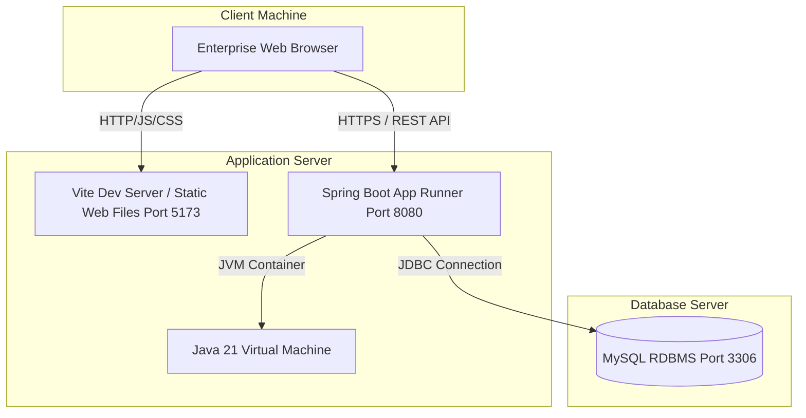
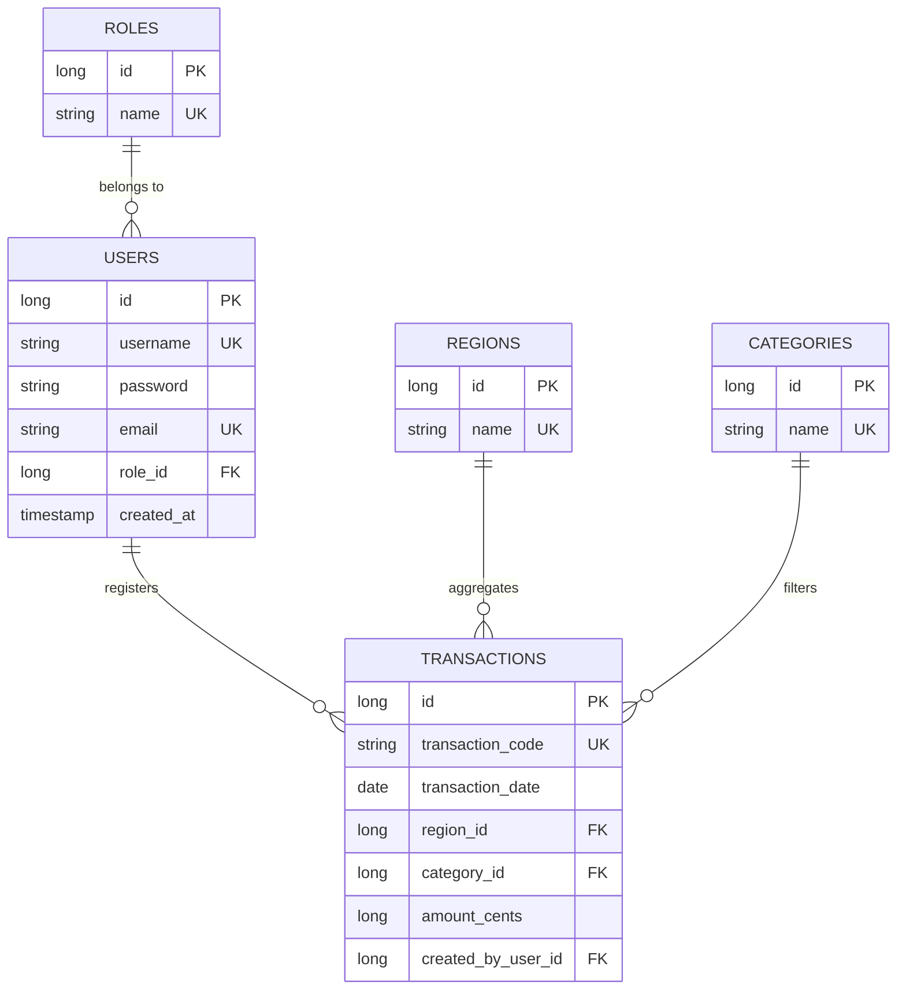
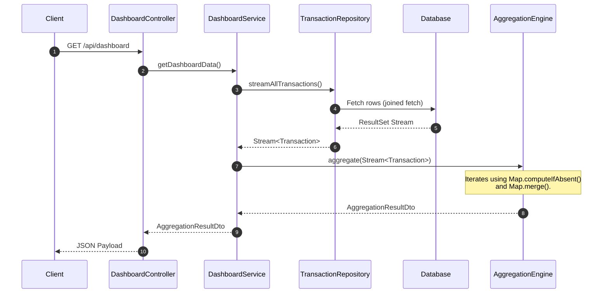

# SalesSphere BI - Enterprise Sales Aggregation & Business Intelligence Platform

SalesSphere BI is an enterprise-grade Business Intelligence (BI) platform built for Retail & E-Commerce organizations. It replaces slow, error-prone, and unscalable spreadsheet pivot tables with a highly performant, secure, and automated real-time transaction rollup engine.

---

## 1. Project Documentation

### 1.1 Problem Statement & Context
A business intelligence team in a large retail organization requires daily aggregation of raw sales transactions. These aggregations must be rolled up by geographic region and, within each region, by product category. 
The existing system relies on manual spreadsheet pivot tables. This manual process suffers from the following limitations:
- **Poor Performance**: Opening and recalculating sheets with >100,000 transactions triggers memory limits and browser crashes.
- **Maintainability Issues**: Complex custom macros break easily during multi-user edits.
- **Data Inconsistencies**: Validation is non-existent, leading to duplicate transaction inputs and decimal precision loss.
- **Security Vulnerabilities**: Lacks role-based authorization, exposing sensitive financial data.

### 1.2 Proposed Solution & Objectives
SalesSphere BI provides a secure, layered enterprise platform that:
- Implements a high-performance **Java Collections Aggregation Engine** to perform calculations entirely in-memory at $O(N)$ time complexity, completely bypassing heavy SQL database group operations.
- Enforces data integrity through strict schema validation and file duplicate checks.
- Implements a flat, solid corporate dashboard styled using vanilla CSS, following Power BI and SAP design principles.
- Secures REST controllers using Spring Security with state-less JWT tokens and role-based access control (RBAC).

---

## 2. System Architecture

```
Presentation Layer (ReactJS Portal)
       │ (REST APIs + JWT Bearer Authorization)
       ▼
Security Filter (Spring Security JWT interceptor)
       │
       ▼
REST Controllers (AuthController, TransactionController, etc.)
       │
       ▼
Service Layer (AuthService, TransactionService, DashboardService)
       │
       ▼
Aggregation Engine (Java Collections Rollup Engine)
       │
       ▼
Repository Layer (Spring Data JPA + Hibernate)
       │
       ▼
Database Layer (MySQL Schema)
```

### 2.1 Component Diagram
```mermaid
component {
  [React UI Client] --> [Axios API Module]
}
database "MySQL" {
  [DB Schema]
}
node "Spring Boot Backend" {
  [Auth Controller] --> [Auth Service]
  [Transaction Controller] --> [Transaction Service]
  [Dashboard Controller] --> [Dashboard Service]
  [Dashboard Service] --> [Aggregation Engine]
  [Transaction Service] --> [CSV Importer]
  
  [Auth Service] --> [JPA Repositories]
  [Transaction Service] --> [JPA Repositories]
  [CSV Importer] --> [JPA Repositories]
  
  [JPA Repositories] --> [DB Schema]
}
[Axios API Module] -->|JSON / JWT| [Spring Boot Backend]
```

### 2.2 Deployment Diagram


---

## 3. Database Schema

The database is normalized to 3NF. It contains the following tables:
1. `roles`: Standard authorization tags.
2. `users`: Credentials, salt-hashed via BCrypt.
3. `regions`: Unique geographic entities.
4. `categories`: Unique product groups.
5. `transactions`: Raw transaction logs, optimized with lookup indexes.
6. `audit_logs`: Operations tracking journal.

### 3.1 Entity Relationship (ER) Diagram


### 3.2 Database Creation Script (MySQL)
```sql
CREATE DATABASE IF NOT EXISTS salessphere_db;
USE salessphere_db;

-- Roles definition
CREATE TABLE IF NOT EXISTS roles (
    id BIGINT AUTO_INCREMENT PRIMARY KEY,
    name VARCHAR(50) NOT NULL UNIQUE
);

-- Users definition
CREATE TABLE IF NOT EXISTS users (
    id BIGINT AUTO_INCREMENT PRIMARY KEY,
    username VARCHAR(50) NOT NULL UNIQUE,
    password VARCHAR(100) NOT NULL,
    email VARCHAR(100) NOT NULL UNIQUE,
    role_id BIGINT NOT NULL,
    created_at TIMESTAMP DEFAULT CURRENT_TIMESTAMP,
    updated_at TIMESTAMP DEFAULT CURRENT_TIMESTAMP ON UPDATE CURRENT_TIMESTAMP,
    FOREIGN KEY (role_id) REFERENCES roles(id)
);

-- Regions definition
CREATE TABLE IF NOT EXISTS regions (
    id BIGINT AUTO_INCREMENT PRIMARY KEY,
    name VARCHAR(100) NOT NULL UNIQUE
);

-- Categories definition
CREATE TABLE IF NOT EXISTS categories (
    id BIGINT AUTO_INCREMENT PRIMARY KEY,
    name VARCHAR(100) NOT NULL UNIQUE
);

-- Transactions definition
CREATE TABLE IF NOT EXISTS transactions (
    id BIGINT AUTO_INCREMENT PRIMARY KEY,
    transaction_code VARCHAR(50) NOT NULL UNIQUE,
    transaction_date DATE NOT NULL,
    region_id BIGINT NOT NULL,
    category_id BIGINT NOT NULL,
    amount_cents BIGINT NOT NULL,
    created_by_user_id BIGINT,
    created_at TIMESTAMP DEFAULT CURRENT_TIMESTAMP,
    FOREIGN KEY (region_id) REFERENCES regions(id),
    FOREIGN KEY (category_id) REFERENCES categories(id),
    FOREIGN KEY (created_by_user_id) REFERENCES users(id),
    INDEX idx_code (transaction_code),
    INDEX idx_date (transaction_date)
);

-- Audit logs definition
CREATE TABLE IF NOT EXISTS audit_logs (
    id BIGINT AUTO_INCREMENT PRIMARY KEY,
    username VARCHAR(100) NOT NULL,
    action VARCHAR(255) NOT NULL,
    details VARCHAR(2000),
    timestamp TIMESTAMP DEFAULT CURRENT_TIMESTAMP
);
```

---

## 4. Aggregation Engine & Core Algorithms

Aggregation is performed fully in Java using the Java Collections Framework (no database `GROUP BY` is utilized).

### 4.1 Process Sequence Diagram


### 4.2 Core Algorithms & Complexity

#### 1. Sales Rollup & KPI Calculation
- **Logic**: Iterates over a stream of raw transaction models. Inserts region and category keys dynamically using `computeIfAbsent()` to build the hierarchy, and performs thread-safe sums using `merge(key, val, Long::sum)`.
- **Time Complexity**: $\mathcal{O}(N)$ where $N$ is the number of transaction logs. HashMap lookups operate in constant $\mathcal{O}(1)$ time.
- **Space Complexity**: $\mathcal{O}(R \times C + R + C)$ where $R$ is unique regions and $C$ is unique categories. Aggregated memory consumption is independent of transaction volume $N$.

#### 2. Top Category Detection
- **Logic**: For each region in `regionCategorySales.entrySet()`, it iterates over the nested category mapping to locate the maximum sales volume.
- **Time Complexity**: $\mathcal{O}(R \times C)$.
- **Space Complexity**: $\mathcal{O}(R)$ to map the top category results.

#### 3. Duplicate Transaction Detection
- **Logic**: When parsing a CSV, transaction codes are processed and validated against a local memory `Set<String>`. A database query check `existsByTransactionCode` is run as a secondary filter.
- **Time Complexity**: $\mathcal{O}(1)$ average per record.
- **Space Complexity**: $\mathcal{O}(N)$ in the worst case for memory tracking.

---

## 5. Agile User Stories

1. **As an Administrator**, I want to create user accounts and designate permissions, so that I can maintain secure access to financial systems.
2. **As a Business Analyst**, I want to upload bulk transaction CSV sheets, so that I can automatically calculate regional aggregates in seconds.
3. **As a Regional Manager**, I want to filter transactions by date ranges and amounts, so that I can review local sales performance.
4. **As a Sales Executive**, I want to manually enter single transactions, so that I can update the system with ad-hoc sales immediately.
5. **As a CEO**, I want to view a high-level summary dashboard with KPIs (like Top Region and Top Category), so that I can make quick strategic decisions.
6. **As a member of the Finance Team**, I want to download CSV summaries of regional revenues, so that I can perform audits and tax rollups.
7. **As an Auditor**, I want to check system activity logs, so that I can trace who uploaded CSV catalogs or deleted transactions.
8. **As an Inventory Manager**, I want to see category rankings, so that I can align stock levels with category sales velocities.

---

## 6. REST API Documentation

### 6.1 Authentication Endpoints
- **POST `/api/auth/register`**: Creates a user profile.
  - *Request Body*: `{ "username": "...", "email": "...", "password": "...", "role": "Viewer" }`
- **POST `/api/auth/login`**: Authenticates user credentials. Returns JWT.
  - *Response*: `{ "token": "eyJ...", "username": "...", "role": "ROLE_VIEWER" }`

### 6.2 Transaction Endpoints
- **GET `/api/transactions`**: Returns paginated list of transactions.
  - *Query Parameters*: `search`, `region`, `category`, `startDate`, `endDate`, `minAmount`, `maxAmount`, `page`, `size`, `sortBy`, `direction`
- **POST `/api/transactions`**: Registers a manual sale. (Admin/Analyst/Manager).
- **PUT `/api/transactions/{id}`**: Modifies transaction parameters. (Admin/Analyst/Manager).
- **DELETE `/api/transactions/{id}`**: Deletes a transaction. (Admin only).
- **POST `/api/transactions/import`**: Processes multipart form CSV data. (Admin/Analyst/Manager).

### 6.3 Dashboard & Reporting Endpoints
- **GET `/api/dashboard`**: Retrieves aggregated KPIs, Region-Category totals, and distribution data.
- **GET `/api/analytics`**: Retrieves rankings and market share percentages.
- **GET `/api/reports/summary`**: Returns structured reporting metrics.
- **GET `/api/reports/regional/csv`**: Downloads the regional rollup report CSV file.
- **GET `/api/reports/category/csv`**: Downloads the category performance report CSV file.
- **GET `/api/reports/executive/csv`**: Downloads the executive overview summary CSV file.

### 6.4 System monitoring
- **GET `/api/health`**: Public check returning `{ "status": "UP" }`.

---

## 7. Installation & Running Guide

### 7.1 Prerequisites
- **Java Development Kit (JDK)**: Version 21.
- **Node.js**: Version 18 or above (comes with `npm`).
- **MySQL Database Server**: Active instance running locally.

### 7.2 Database Setup
Create the target schema in your MySQL shell:
```sql
CREATE DATABASE salessphere_db;
```

### 7.3 Backend Setup
1. Navigate to the backend directory:
   ```bash
   cd backend
   ```
2. Configure database credentials in `src/main/resources/application.yml` or set environment variables:
   ```properties
   SPRING_DATASOURCE_URL=jdbc:mysql://localhost:3306/salessphere_db
   SPRING_DATASOURCE_USERNAME=root
   SPRING_DATASOURCE_PASSWORD=yourpassword
   ```
3. Run the Spring Boot application using the portable Maven wrapper:
   ```bash
   ..\maven\bin\mvn.cmd spring-boot:run
   ```

### 7.4 Frontend Setup
1. Navigate to the frontend directory:
   ```bash
   cd frontend
   ```
2. Install npm packages:
   ```bash
   cmd /c "npm install"
   ```
3. Boot the Vite development server:
   ```bash
   cmd /c "npm run dev"
   ```
4. Open the browser to: `http://localhost:5173`.
5. Log in with the default seeded account:
   - **Username**: `admin`
   - **Password**: `admin123`

---

## 8. Verification & Testing Strategy

- **Core Calculations Suite**: Aggregations are unit tested under `AggregationEngineTest.java` to ensure correctness of math, edge cases, and empty states.
- **Data Import Suite**: File parser and CSV mapping rules are validated under `CsvImportServiceTest.java`.
- **Command to run tests**:
  ```bash
  cd backend
  ..\maven\bin\mvn.cmd test
  ```
